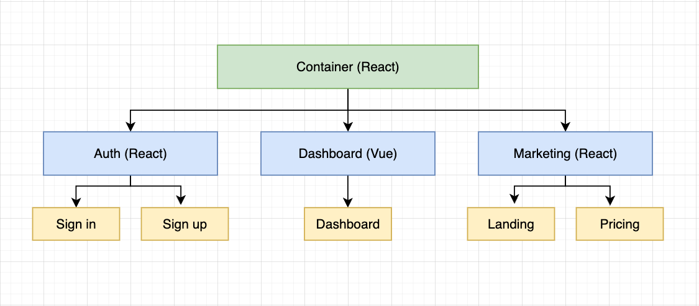

# Microfrontends experiment

This repository is just a bit of a playground for me to learn microfrontends. The application consists of the following microfrontends:  
Auth, Dashboard, Marketing and finally Container which loads in the child mircofrontends.

Each of these can be ran locally as a standalone application.

This application purposely uses multiple frontend frameworks just to demonstrate how this might be acheived and how they might still be able to communicate
effectively with one another.

This microfrontend driven application is built using Webpack Federation and each microfrontend is hosted on AWS S3 behind a CloudFront distribution.

You can access the page that pulls in various microfrontends [here](https://dgaa7jcf57j0d.cloudfront.net/)
